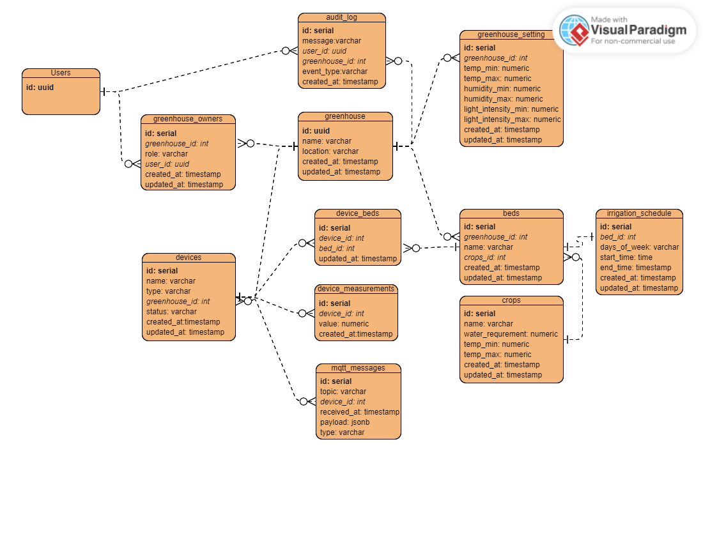

# backend

## database структура

### Комментарии к базе данных

#### users

Таблица представлена как заглушка. Реализация базы данных полностью преляжет на Keycloak.

#### devices

_type_ - тип устройства, например, термометр, окно и так далее
_status_ - off, on, broken

#### device_measurements - считанными с устройств данные

#### device_beds - связь грядок и девайсов для них

#### mqtt_messages - история сообщений из топиков

_type_ - сообщение отправленное в топик, полученое из топика

На данный момент мне не уверен в необходимости данной таблицы.
Взял ее из других работ и привел к читабельному виду.

#### greenhouse

_location_ - расположение теплицы. Может быть полезно при использовании системы из нескольких теплиц 
или для просмотра, надивгающейся погоды с интернет ресурсов. На данный момент считаю ненужной для mvp.

#### greenhouse_owners - пользователи владеющие правами на теплицу

#### greenhouse_settings - настройки теплицы

#### greenhouse_schedules

#### crops - культуры

Я предполагаю, что изначально в приложении будут данные о некоторых культурах, при желании пользователь сможет создавать
необходимые для него культуры. На основе данных о культурах, которые будут указаны в грядках, будет настраиваться базовая
конфигурация умной теплицы. В случае, если культуры несовместимы по условиям (температруа или освещение) пользователь будет
уведомлен об этом.

#### beds - грядки

#### irrigation_schedule - расписание полива

_days_of_week_ - дни в которые будет проискходит полив

Предусматривается, что все поливы будут работать с одинаковой мощностью

#### audit_log

История работы приложения, пользовательские действия в нем, изменение пользователями настроек и так далее
